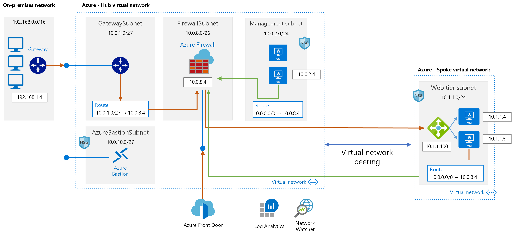

# Azure Networking Terraform lab templates

## Overview

 In this hands-on lab, you will setup a virtual networks in a hub-and-spoke design. You will also learn how to secure virtual networks by implementing Azure Firewall, network security groups and application security groups, as well as configure route tables on the subnets in your virtual network. Additionally, you will set up access to the virtual network via a jump box and provision a site-to-site VPN connection from another virtual network, providing emulation of hybrid connectivity from an on-premises environment.

At the end of this hands-on lab, you will be better able to configure Azure networking components and you will be learning:

- How to bypass system routing to accomplish custom routing scenarios.

- How to setup and configure a virtual network and subnets on Azure

- How to capitalize on load balancers to distribute load and ensure service availability.

- How to implement Azure Firewall to control hybrid and cross-virtual network traffic flow based on policies.

- How to implement a combination of Network Security Groups (NSGs)  to control traffic flow within virtual networks.

- How to monitor network traffic for proper route configuration and troubleshooting.

- How to create all required infrastructure and configuration using Terraform

## Network Architecture

## Requirements

- Valid the Azure subscription account. If you don’t have one, you can create your free azure account (https://azure.microsoft.com/en-us/free/).

# Credits:
This lab infrasctucture was created and inspired based on Adilson Coutrin Azure Basic Networking Lab:
https://github.com/adicout/lab/tree/master/Network/basic-networking

